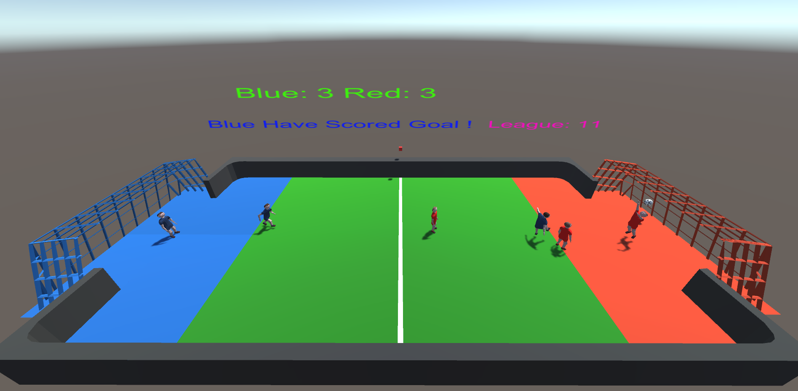

# Unity ML Agent: DuffBall Team Play

A review of Unity ML Agents to train Agents in a simple Team play environment.  The intention is to review ML Agents playing a soccer like game, but with Tactical level Observaitons and Actions, rather than the typically base Movement/ Rotations level Actions in used in many Unity ML examples.  Hopefully the Training will then be faster and more robust.  

Please see the results of the Trained Duff Ball Agents playing reasonably well at << You Tube Reference >>

The results are as expected. The Tactical level Reinforcement Learning results in Faster and More robust Training to achieve reasonably good player performance. However the Agents did not learn any need to perform any collaborative play. Their Goal Rewards could be achieved without any collaboration due to the environmental features. Self Play was even more robust, and faster to train however the gameplays were not as diverse (Same rush/ converge tacticsaby both sides. 

### Duff Ball Overview 
The Environment is two teams playing a soccer like game. A Red and a Blue Team. There are three players, per side, however the Goalies are non trainable characters, and merely act in their own goal areas to protect their own goals, as game characters.  The principle players are the two mid field players on each side, which can traverse the pitch, and have a range of Tactical Actions available to them.  

Two Experiments have been conducted: 
- Experiment A: ML Agents Blue Team is trained against a pre programmed Red Player, with some simple tactical Logic. The Training is advanced through Curriculum Learning
- Experiment B: Both the Red and Blue Side are configured as ML Agents, and are trained as Self Play against each other.    

### Agent Set Up
The intention is to review team learning at a Tactical level, rather than a low level movement/rotation/basic action level.

So the Tactical Actions Are: {None, ChaseBallPlayer, DribbleForward, DribbleWide, Goto_Defence, Goto_Attack, StrikeBall, Pass_Ball} 

These Actions are Masked, such that if the ML Agent Does Not currently have the Ball, it can only recommend and perform: { None, ChaseBallPlayer, Goto_Defence, Goto_Attack}  and when it has the Ball the masked Actions are then: { None, DribbleForward, DribbleWide, StrikeBall, Pass_Ball} 

The Observation Space is limited to:
- float: NormalisedDistanceForward   - Proportional distance up the Pitch, towrards the Opposite Goal
- bool: Player Has the Ball
- bool: BallTeamOwnership
- bool: The Player Is Within Striking Range
- bool: An Opposition Player Is Close
- bool: The Player is Closest To the Ball
- bool: Team Mate Is Forward 

This Observation and Action Space was identified as being sufficient for a logical agent to play a basic, competitive game of Duffball. The programmed Red Player Agent, in Experiment A, uses a basic Tactical Decision Table, based upon these Observations, to Propose its own Tactical Actions. See PlayerControl.cs: ReviewTacticalActions() method for this basic player logic. 

There are no local Raycast based sensors etc. 

Since this is now (Collaborative) Unity Team Training. The rewards are Allocated on a Group basis.  The GameControl.cs script manages the resigration of ML Team Groups and the assignment of Group Rewards. The Team Groups are set up and Registered via RegisterAgent() calls.  In Experiment A, with only the Blue Team being Trained, only the Blue Team players are Registered. In Experiment B, with Self Play, both Team need to be Regsistered, into two Groups, with each Agent assigned with their corresponding Team id.

The Group Rewards are then:
- AddGroupReward(1 - 0.5f*(float)DecisionCounter / MaxNumberOfDecisions);     For a Goal Scored by Own side, with a penalty for length of game (Decsion Count)
- AddGroupReward(-1);      When the Opposing team scores a Goal

The Games are coordinated by the GameControl.cs, which Resets all the players after a Goal has been scored by the ResetKickOff() method. Thsi script assigns Rewards to the ML Agent Groups, and is responsible for reviewing and advancing the Curriclum Learning, in Experiment A. It maintains a count of any New decsions that have been made by each Agent. This is to identify excessive game lengths and penalise excessive dithering. Note Decision Count was used instead of Game Steps, since for many actual Game Updates, new decisions can not actually be performed, whilst the Players are in a Celebrating period, or during a hysteresis count down since last active decision.   

The DuffBallMLConfig.yaml configuration is set up to use the Unity ML POCA Multi-Agent POsthumous Credit Assignment (MA-POCA)  algorithm, which I believe is based around PPO. 

The rest of the environment is a lot of player statement management and animation control stuff, with the players transisting through their own states machines. There are various Ball distance proxmitary calculations, invoking Goal Miss/ Save and Tackle checks, and various Random Variables associated with Goal Strike Aim points, and capturing Ball from Tackles etc. ( Note These detailed characteristcs have to be tuned for a reasonably fun and fair game experience.  They also a dramatic impact upon the statistically preferred ML Agent Action choices, and hence behaviours.)     

Both the Goalies are managed by their own GoalKeeperControl.cs scripts. 

The game Arena, Blue, Red Team, Ball and Game Objects are all captured within a GameEnvironment Unity Prefab. So any changes to the Agent should be done within this Prefab. This Prefab is then used as a basis for replicating 8x GameEnvironment Game Objects within the Training Scene, to speed up Training. 

### Experiment A : Curriculum Learning
See the original Scripts used for Curriculum Learning under the ExpACurriclum Folder.   

The 2x Blue Team players are set up as ML Agents. See the MLPlayer.cs script. 
The Red Players are left with the programemd logic See PlayerControl.cs: ReviewTacticalActions() 

The Training of the Blue Agents is then advanced through Curriculum Learning. Initially at Game Level 1, with the Red Players having very small Speeds, and the Blue Players starting closer to the Ball at the Lower Game levels.  The Game Level is advanced, within the GameControl.cs when the BluePlayer Scores are 125% greater than the Red Player Scores.  As the Game level increases the Red players are given higher speeds, approaching those of the Blue Players, and more diverse initial player distribution after Kick Offs.  The Game Level can advance to level 12, where the teams have same performance characteristics.   

### Experiment B : Self Play Learning
Both the Red and the Blue team are assigned as being ML Agents, with both teams having the MLPlayer.cs scripts assigned to their players. There are no programemd players, so there is then no active use of PlayerControl.cs scripts. (Excepting the Goalies, using their own GoalKeeperControl.cs scripts ) 

The Game Manager (GameControl.cs script) assigns Group rewards to both the Blue and Red Teams, as a function of which side scored the goal. (This follows very simuilar to the Unity ML Soccer Twos example and configuration)

The Selfplay configuration is added to the DuffBallMLConfig.yaml configuration file: 
self_play:
      save_steps: 20000
      team_change: 100000
      swap_steps: 10000
      window: 10
      play_against_latest_model_ratio: 0.5
      initial_elo: 1200.0

## Conclusions

- As expected, training Agents at a Tactical level, is a much faster and more robust Training experience than getting low level movement/rotation action agents to perform. 
- Adequate ML Agent performance can be achived within 5 Million Steps. 
- There was very little hassle in experimenting and adjusting the poca hyper parameters. "Good performance" was easily obtained with batch_size: 2024, buffer_size: 20480, hidden_units: 512, time_horizon:512, with the otehr PPO parametrs at the Unity defaults. See the DuffBallMLConfig.yaml file. 
- However the Agents do not need to develop or perceive any advantage in collaborative play. They can achieve high goal rates simply by the sequence of Pursue, Dribble and Strike actions, with no Passing between team mates!  (This is probably due to passing success rates being rather low in a player congested environment with a colliding dynamic ball verses a low Tackle success rate to maintain game flow!)
- It was noted that the Agent Players sometimes do not Actively defend, if opposing player is approaching them, and their goal with the Ball
- Self Play was faster to train than the Curriculum Learning Process. However the resulting play was less diverse, as both teams then adopted the rush to Ball, Dribble and Strike tactic, resulting in clustered and heavily contested game play!

Happy for Any Discusssion, Comments and Improvements.

## Download and Use

This project has been exported as a Unity Package containing the DuffBall Scene, Scripts, Models etc. I am not so familiar with Unity Package export/ imports, so hopefully this is the most convenient way to import into your Unity Projects.   This can be downladed and imported into Unity, or possibly via the Unity Git import directly by reference to the .json file from the Unity Package Manager.  You will also need to import the Unity ML Agents run time package (Note this project was developed and Tested using Unity ML Agents Release 19)

The default downloaded Unity Project, will execute Experiment B: The Self Play configuration.  To perfom the Curriculum Learning, will require use of the files within the ExpACurriclumFiles Folder.

## Acknowledgements  

- Unity ML Agents at:  https://github.com/Unity-Technologies/ml-agents
- Jason Weimann: Unity and Game Development: https://www.youtube.com/c/Unity3dCollege
- Immersive Limit: Unity Machine Learning Agents: https://www.youtube.com/c/ImmersiveLimit

